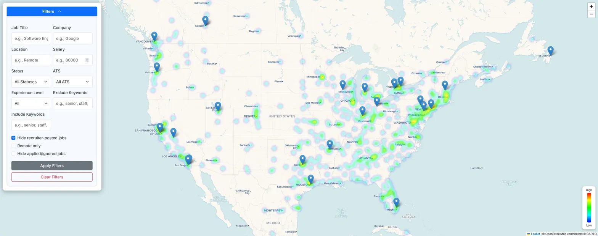

# Job Hunt Pipeline


Automated job board aggregating 1,000,000+ positions from 20,000+ companies across seven major ATS platforms. Updated daily via GitHub Actions.

## Live Site

_Deploy your own — see [Local Development](#local-development) or [deploy/README.md](deploy/README.md)._

## Features

- **Multi-platform scraping**: Greenhouse, Lever, Ashby, BambooHR, iCIMs, Paylocity, and Workday APIs scraped in parallel using `concurrent.futures`
- **Progressive loading**: Chunked gzip data loaded via Web Workers for fast initial render
- **Advanced filtering**: Filter by title, company, location, ATS platform, experience level, and exclude keywords. Toggle remote-only, hide recruiter postings, or hide already-applied jobs
- **Job tier classification**: Automatic skill-level tagging (intern/entry/mid/senior) using weighted keyword scoring on job titles
- **Application tracking**: Mark jobs as saved, applied, or ignored with batch update support via localStorage
- **URL state sync**: Filter/sort/page state persisted in the URL for shareable/bookmarkable searches
- **Responsive design**: Desktop table view with card-based mobile layout
- **Automated pipeline**: Daily GitHub Actions workflow: fetch existing data → scrape → merge → push chunks to the data repo → create release
- **Trend tracking + anomaly detection**: Daily per-platform counts are appended to a trend log; a check flags any platform whose volume deviates sharply from its recent baseline and opens a GitHub issue
- **Interactive heatmap**: Map view showing job density by location



## Tech Stack

| Layer    | Tools                                                  |
| -------- | ------------------------------------------------------ |
| Frontend | Vanilla JavaScript (ES Modules), Bootstrap 5, HTML/CSS |
| Scraping | Python 3.12, `requests`, `concurrent.futures`, `gzip`  |
| Data     | Chunked gzip JSON, Web Workers for decompression       |
| CI/CD    | GitHub Actions (daily cron + manual dispatch)          |
| Hosting  | GitHub Pages (app), plus a second Pages site for data  |

## Architecture

```
scripts/
├── scraper.py          # Multi-ATS scraper with parallel fetching (--shortlist for the fast tier)
├── merge_data.py       # Deduplicates, prunes stale jobs (>30 days), computes the new-job key diff
├── geolocation.py      # Location lookup/enrichment for the heatmap
├── role_filter.py      # Role preset matcher (shared config with the frontend)
├── build_shortlist.py  # Derives the hourly fast tier's target company list
└── check_anomalies.py  # Per-platform volume anomaly detection on the trend log

js/
├── app.js              # Main app class and initialization
├── jobs_loader.js      # Progressive chunk loading + Web Worker orchestration
├── chunk_worker.js     # Web Worker for gzip decompression
├── filters.js          # Filter logic with regex matching
├── sort_logic.js       # Client-side sort with alpha/numeric handling
├── renderer.js         # Table/card rendering with pagination
├── storage.js          # localStorage wrapper for application tracking
├── columns.js          # Column definitions and custom renderers
├── events.js           # Event listener setup
├── url_state.js        # URL query string sync
├── role_filter.js      # Role preset matcher (mirrors scripts/role_filter.py)
└── ui_utils.js         # Toast notifications, HTML escaping, utilities

data/
├── *_companies.json    # Company lists per ATS platform (tracked on main)
├── salary/             # Salary lookup table, sharded a-z (static input)
├── locations.json      # Geolocation lookup
├── role_filter.json    # Role preset: include/exclude patterns + target levels
├── role_shortlist.json # Fast-tier target companies (regenerated by each daily run)
└── trends/daily.jsonl  # Append-only daily trend history (one JSON object per line)

# Chunked job data (jobs_chunk_*.json.gz + jobs_manifest.json) is NOT in this repo.
# Each run force-pushes it to a separate data repo, which serves the chunks
# over its own GitHub Pages site (Fastly-backed CDN).
# This keeps the code repo small and code-only while the data repo stays flat
# (force-pushed each run, so it never accumulates history).
```

## Data Pipeline

1. **Scrape**: `scraper.py` fetches jobs from all seven ATS APIs concurrently. Worker counts are tuned per platform to respect each one's rate limits: 50 for Workday, 30 for Greenhouse/Lever/iCIMs, 10 for BambooHR, and 5 for Ashby/Paylocity (the tightest limiters).
2. **Classify**: Each job is tagged with a skill level based on title keywords and flagged if posted by a recruiting agency
3. **Clean**: Jobs missing titles, URLs, or company info are dropped
4. **Chunk**: Results are split into ~25k-job gzipped chunks with a manifest file
5. **Merge**: `merge_data.py` deduplicates against existing data and prunes jobs older than 30 days
6. **Monitor**: A daily trend snapshot (per-platform and per-tier counts) is appended to `data/trends/daily.jsonl` and committed to main. `check_anomalies.py` compares each platform against its recent baseline and opens an issue if one drops off or spikes abnormally.
7. **Deploy**: GitHub Actions force-pushes the regenerated chunks to a separate `job-board-data` repo and creates a tagged release on main. The frontend fetches chunks from the data repo's GitHub Pages site, keeping the main repo code-only.

## Finding New Jobs First

Two tiers run on different schedules:

| Tier | Schedule | Scope | Runtime |
| ---- | -------- | ----- | ------- |
| Full scrape (`scrape-jobs.yml`) | daily, 07:33 UTC | all ~60k companies | hours |
| Fast tier (`fresh-jobs.yml`) | hourly, :17 | only companies that recently posted matching roles | minutes |

Both share a `job-data-pipeline` concurrency group so they never force-push the data repo at the same time.

**What counts as "new".** `merge_data.py` diffs this scrape's dedup keys against the keys it already knew about, and stamps `first_seen` only on keys that weren't there before. That diff is exact, which matters because the per-ATS posting dates are not: Ashby, BambooHR and Lever never send `updated_at` at all, Greenhouse uses it to mean "last edited", and Workday's is reverse-engineered from strings like "Posted 2 Days Ago". Sorting by `first_seen` is therefore the only reliable newest-first ordering.

**In the UI.** The "New for me" button applies the role preset, limits to jobs first seen in the last 24h, hides already-applied jobs, and sorts newest-first. State lives in the URL (`?roles=1&fresh=24&sort_key=first_seen&sort_dir=desc`), so it's bookmarkable.

**Filtering by country.** Jobs carry an ISO country code resolved from their location string — by the scraper for new jobs, and by `scripts/backfill_country.py` for anything scraped before the field existed. The Country / Region dropdown is built from whatever is loaded, ordered by job count, so the options show real numbers.

About 40% of jobs have no resolvable country, because a lot of ATS locations are placeholders: iCIMS never sends one ("Not specified"), Workday often says "3 Locations", and plenty are just "Remote" or "Hybrid". Rather than hide that, the dropdown offers an explicit "Unknown location" option and a checkbox to include country-less jobs alongside a country selection.

**Pipeline status.** [`status.html`](status.html) reports when the data was last fetched (absolute, relative, and flagged red past 26h), how many jobs arrived in the last run, and each platform's volume against its own 7-day average — a platform far below its baseline usually means that ATS started blocking the scraper.

**Tuning the preset.** Edit [`data/role_filter.json`](data/role_filter.json) — `include`/`exclude` are case-insensitive regex matched against the job title, and `levels` filters on the scraper's skill-level tags. Both `scripts/role_filter.py` and `js/role_filter.js` read that one file, so the hourly shortlist and the UI filter can't drift apart. Patterns must stay valid in both Python `re` and JS `RegExp`.

## Company Discovery

Company lists are built from Common Crawl index data using a separate harvesting pipeline. The harvester scans CDX archives for URLs matching 20+ ATS domain patterns, extracts company slugs via regex, and deduplicates across multiple crawl snapshots. This currently yields give or take 95,000 unique company identifiers.

## Local Development

```bash
git clone <your-repo-url>
cd job-hunt-pipeline
python -m http.server 8000
# Visit http://localhost:8000
```

By default the frontend fetches live chunk data from the data repo's Pages site, so local development works against current data without needing the chunks checked out locally.

### Running the pipeline locally

The GitHub Actions workflows only run on GitHub's servers — a local clone has no scheduler. `scripts/run_local.sh` is the manual equivalent:

```bash
pip install -r requirements.txt

./scripts/run_local.sh seed        # one-time: pull the published dataset as a baseline
./scripts/run_local.sh shortlist   # derive your role shortlist from it
./scripts/run_local.sh fast        # scrape only shortlisted companies, then merge (minutes)
./scripts/run_local.sh serve       # serve the site against your local data

./scripts/run_local.sh new         # print jobs first seen in the last 24h
./scripts/run_local.sh full        # scrape every company (hours)
```

When served from localhost the frontend prefers `./data/chunks` if a manifest is present, so a local scrape is visible immediately; a `local data` badge appears next to "Last updated" so it's never confused with the published dataset. Force either source with `?data=local` or `?data=remote`.

`build_shortlist.py --from-chunks` (what `shortlist` uses) reconstructs Workday and Paylocity slugs by reversing the tracked company lists, since the slim chunk records drop `company_slug`. That matters — Workday is the largest single source of matching jobs.

## License

Code in this repository is licensed under the MIT License - see the [LICENSE](LICENSE) file for details.

The curated company datasets in `data/` are licensed under [CC BY-NC 4.0](https://creativecommons.org/licenses/by-nc/4.0/). You're free to use, modify, and share the data for non-commercial purposes. Commercial use of the datasets requires permission from the original author.

## Credits

Originally created by Riley Dorrington. This is an independent continuation,
not affiliated with or endorsed by the original author.

- **Code** — MIT, see [LICENSE](LICENSE). The copyright notice is retained as
  the licence requires.
- **Curated datasets in `data/`** (company lists, salary table, gazetteer) —
  [CC BY-NC 4.0](https://creativecommons.org/licenses/by-nc/4.0/): attribution
  required, **non-commercial use only**. If you intend to monetise anything
  built on those files, you need permission from the original author or you
  must regenerate them yourself.
